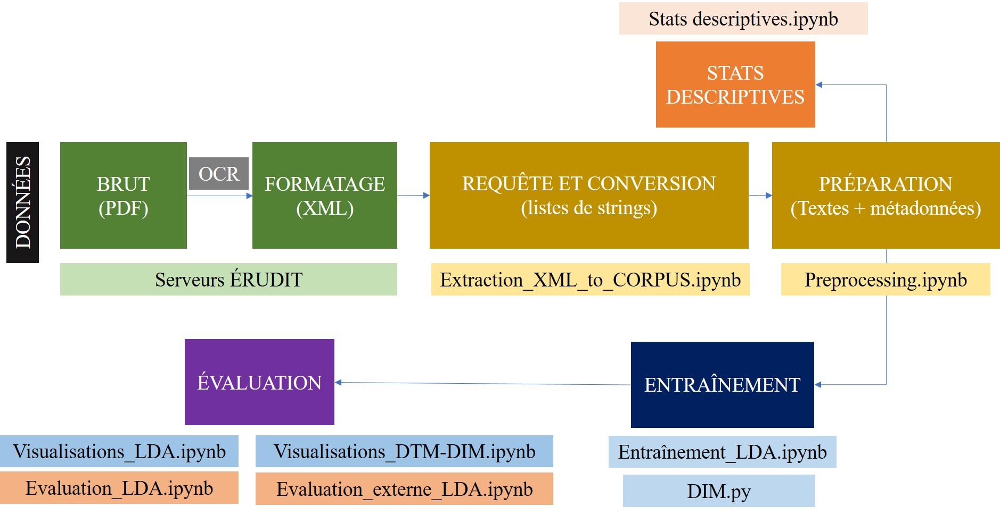
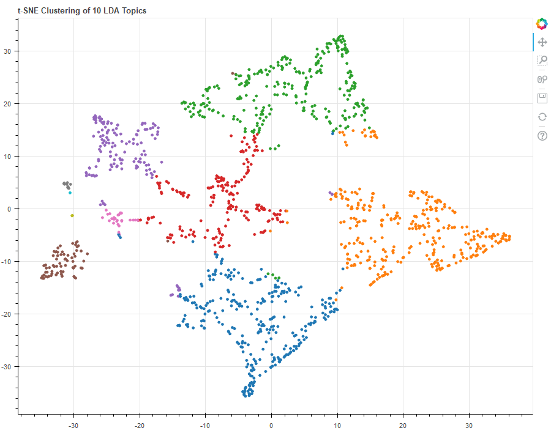

# topic-models-SHS
Code associé à mon projet de maîtrise portant sur la modélisation thématique de trois revues québécoises en sciences humaines et sociales

## Code
Contient les notebook utilisés pour ce travail, menant pas à pas de l'extraction de données jusqu'à l'évaluation des résultats des modèles de thèmes.
 

 
## Résultats
Présente les principaux résultats obtenus pour les modèles LDA, DTM et DIM sous forme de graphes, tableaux et de visualisations.

Pour toute question concernant ce dépôt, contactez arthur.tobler@polymtl.ca
